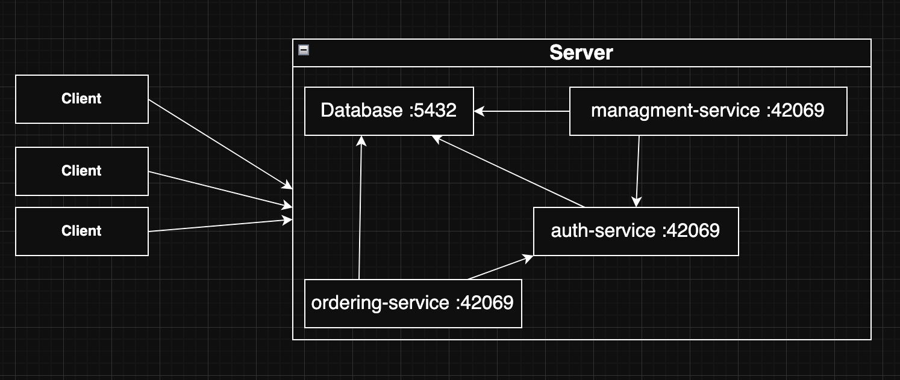

# golang-dining-ordering
heygreet clone - backend for ordering at the restaurant

### Dev Dependencies
- **[golang-migrate](https://github.com/golang-migrate/migrate)** – Database migrations
- **[sqlc](https://github.com/sqlc-dev/sqlc)** – Generate models and DB functions from migration files

### Pre-Commit Tools
- **[golangci-lint](https://github.com/golangci/golangci-lint)** – Linter for Go code


## Running the API

You can run the API in different ways:

### Directly with Go
```bash
go run cmd/main.go
```

### Using Docker
```bash
docker compose up -d --build
```

### Make commands
```bash
make run-api
```

```bash
make run-all
```

## Architecture


